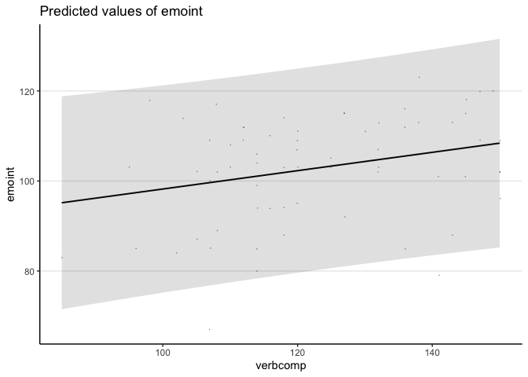
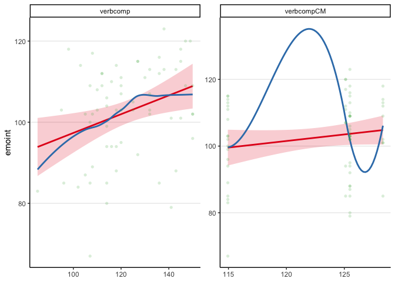
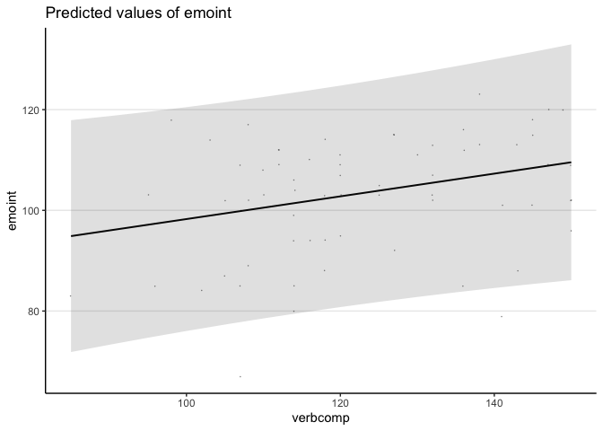

HW 9
================
Roshni Lulla
2022-11-15

# Revised Prospectus

My project proposal will be using data collected at the Brain &
Creativity Institute. The Institute focuses on understanding
consciousness, emotions, decision-making, and other cognitive processes,
primarily through neuroimaging studies. This project will specifically
be focusing on the Institute’s recent Affective Intelligence project
that used functional magnetic resonance imaging (fMRI) along with
extensive neuropsychological testing to assess facets of emotional
processing. The current research will focus on the behavioral metrics
obtained through neuropsychological testing, during which participants
completed the Mayer-Salovey-Caruso Emotional Intelligence Test (MSCEIT),
the NEO-Personality Inventory, the Wechsler Adult Intelligence Scale
(WAIS), and the Interpersonal Reactivity Index (IRI). These metrics
spanned various aspects of cognitive functioning and emotional
processing, and were collected after participants completed emotional
tasks in an hour-long fMRI scan, on a separate day.  
  
This analysis will focus on understanding how some lower level cognitive
metrics might predict higher-level processes such as emotion
recognition. Based on this evaluation, we will also incorporate gender
and age as level two predictors to incorporate differences in emotional
processing that are known to exist across these variables. Since age was
collected as a numerical value, age groups will be created in order to
evaluate this level two predictor as a categorical value. We will
specifically be investigating how verbal comprehension from the WAIS
could predict emotional intelligence measured by the MSCEIT, as well as
how interactions between gender and age might act as additional
predictors of this relationship. Previous literature has identified an
interaction between verbal knowledge and emotion concept
representations. There is additionally a known association between
gender and emotion comprehension, indicating that females are generally
better than men at distinguishing and representing emotions. Based on
this association, we would hypothesize that females may rely on verbal
comprehension to a lesser degree compared to men. This would result in a
smaller effect of verbal comprehension in predicting emotional
intelligence specifically in women.  
  
The data is currently stored as an excel document, with the WAIS and
MSCEIT scores listed out for each participant along with their
respective gender and age information. The first step of the analysis
will be to create age groups in order to have a categorical variable as
the level two predictor in the model. This will involve reviewing the
distribution of ages across all participants and identifying the
quantiles they fall into. Based on this review, we will create age
groups that are representative of the age distribution in the study
population. We will then create models to understand the relationship
between verbal comprehension and emotional intelligence. Focusing first
on the interaction of our level one predictor, we will create a model
looking at how verbal comprehension may predict emotional intelligence
without the effects of age or gender. The next step will be looking at
how age might impact this relationship as an individual level two
predictor, and then as gender as an individual level two predictor. We
will also look at the interaction of these level two predictors in a
separate model. After comparing the results of these models, we can
decide on next steps in terms of how to further the analysis or include
additional predictors at either level one or two.

# Preliminary Analysis

## Import Data

## Variable Summary

-   `agegroup`: Participant Age Group
-   `gender`: Participant Gender
-   `verbcomp`: Abstract verbal reasoning, semantic knowledge, and
    verbal expression as measured by the WAIS
-   `emoint`: The ability to accurately identify others’ emotions,
    causes of emotions, and the ability to incorporate this emotional
    intelligence into cognitive processes as measured by the MSCEIT

``` r
datasummary(gender ~ (verbcomp + emoint) * (N + Mean + SD + Histogram),
            data = dat)
```

| gender | verbcomp / N | verbcomp / Mean | verbcomp / SD | verbcomp / Histogram | emoint / N | emoint / Mean | emoint / SD | emoint / Histogram |
|:-------|-------------:|----------------:|--------------:|---------------------:|-----------:|--------------:|------------:|-------------------:|
| F      |           35 |          123.83 |         16.23 |           ▂▁▇▃▇▁▂▄▃▅ |         35 |        104.83 |       10.94 |         ▁▂▃▂▂▅▇▇▄▂ |
| M      |           31 |          121.61 |         16.52 |           ▁▁▂▃▇▂▄▃▁▄ |         31 |        100.13 |       12.74 |          ▁▁▄▁▂▇▂▃▃ |

## Intraclass Correlation

``` r
m0 <- lmer(verbcomp ~ (1 | agegroup), data = dat)

summary(m0)
```

    ## Linear mixed model fit by REML. t-tests use Satterthwaite's method [
    ## lmerModLmerTest]
    ## Formula: verbcomp ~ (1 | agegroup)
    ##    Data: dat
    ## 
    ## REML criterion at convergence: 549.8
    ## 
    ## Scaled residuals: 
    ##     Min      1Q  Median      3Q     Max 
    ## -2.0928 -0.6953 -0.2569  0.7630  2.0220 
    ## 
    ## Random effects:
    ##  Groups   Name        Variance Std.Dev.
    ##  agegroup (Intercept)  20.88    4.57   
    ##  Residual             249.54   15.80   
    ## Number of obs: 66, groups:  agegroup, 4
    ## 
    ## Fixed effects:
    ##             Estimate Std. Error      df t value Pr(>|t|)    
    ## (Intercept)  123.006      3.094   3.049   39.76 3.06e-05 ***
    ## ---
    ## Signif. codes:  0 '***' 0.001 '**' 0.01 '*' 0.05 '.' 0.1 ' ' 1

``` r
performance::icc(m0)
```

    ## # Intraclass Correlation Coefficient
    ## 
    ##     Adjusted ICC: 0.077
    ##   Unadjusted ICC: 0.077

## Model

Level One


Level Two


  

``` r
m1 <- lmer(emoint ~ verbcomp + verbcompCM + (1 | agegroup) + (1 | gender), data = dat)
summary(m1)
```

    ## Linear mixed model fit by REML. t-tests use Satterthwaite's method [
    ## lmerModLmerTest]
    ## Formula: emoint ~ verbcomp + verbcompCM + (1 | agegroup) + (1 | gender)
    ##    Data: dat
    ## 
    ## REML criterion at convergence: 507.1
    ## 
    ## Scaled residuals: 
    ##     Min      1Q  Median      3Q     Max 
    ## -2.5949 -0.7143  0.1800  0.7333  1.6996 
    ## 
    ## Random effects:
    ##  Groups   Name        Variance Std.Dev.
    ##  agegroup (Intercept)   3.584   1.893  
    ##  gender   (Intercept)   6.466   2.543  
    ##  Residual             127.535  11.293  
    ## Number of obs: 66, groups:  agegroup, 4; gender, 2
    ## 
    ## Fixed effects:
    ##             Estimate Std. Error       df t value Pr(>|t|)  
    ## (Intercept) 47.11299   41.30951  1.75445   1.140   0.3860  
    ## verbcomp     0.20375    0.09094 60.77005   2.241   0.0287 *
    ## verbcompCM   0.25027    0.34819  2.03934   0.719   0.5457  
    ## ---
    ## Signif. codes:  0 '***' 0.001 '**' 0.01 '*' 0.05 '.' 0.1 ' ' 1
    ## 
    ## Correlation of Fixed Effects:
    ##            (Intr) vrbcmp
    ## verbcomp    0.005       
    ## verbcompCM -0.964 -0.266

``` r
confint(m1)
```

    ## Computing profile confidence intervals ...

    ## Warning in nextpar(mat, cc, i, delta, lowcut, upcut): unexpected decrease in
    ## profile: using minstep

    ## Warning in FUN(X[[i]], ...): non-monotonic profile for .sig01

    ## Warning in confint.thpr(pp, level = level, zeta = zeta): bad spline fit
    ## for .sig01: falling back to linear interpolation

    ## Warning in regularize.values(x, y, ties, missing(ties), na.rm = na.rm):
    ## collapsing to unique 'x' values

    ##                   2.5 %      97.5 %
    ## .sig01        0.0000000   5.6662544
    ## .sig02        0.0000000   9.0757152
    ## .sigma        9.5006313  13.4465455
    ## (Intercept) -13.2728610 120.3634957
    ## verbcomp      0.0302624   0.3910025
    ## verbcompCM   -0.3857618   0.7638937

``` r
#checking if the inclusion of cluster mean centered values makes this interaction more significant 
m2 <- lmer(emoint ~ verbcompCMC + verbcompCM + (1 | agegroup) + (1 | gender), data = dat)
summary(m2)
```

    ## Linear mixed model fit by REML. t-tests use Satterthwaite's method [
    ## lmerModLmerTest]
    ## Formula: emoint ~ verbcompCMC + verbcompCM + (1 | agegroup) + (1 | gender)
    ##    Data: dat
    ## 
    ## REML criterion at convergence: 507.1
    ## 
    ## Scaled residuals: 
    ##     Min      1Q  Median      3Q     Max 
    ## -2.5949 -0.7143  0.1800  0.7333  1.6996 
    ## 
    ## Random effects:
    ##  Groups   Name        Variance Std.Dev.
    ##  agegroup (Intercept)   3.584   1.893  
    ##  gender   (Intercept)   6.466   2.543  
    ##  Residual             127.535  11.293  
    ## Number of obs: 66, groups:  agegroup, 4; gender, 2
    ## 
    ## Fixed effects:
    ##             Estimate Std. Error       df t value Pr(>|t|)  
    ## (Intercept) 47.11299   41.30951  1.75445   1.140   0.3860  
    ## verbcompCMC  0.20375    0.09094 60.77005   2.241   0.0287 *
    ## verbcompCM   0.45402    0.33563  1.76411   1.353   0.3235  
    ## ---
    ## Signif. codes:  0 '***' 0.001 '**' 0.01 '*' 0.05 '.' 0.1 ' ' 1
    ## 
    ## Correlation of Fixed Effects:
    ##             (Intr) vrbCMC
    ## verbcompCMC  0.005       
    ## verbcompCM  -0.998 -0.005

``` r
confint(m2)
```

    ## Computing profile confidence intervals ...

    ##                    2.5 %      97.5 %
    ## .sig01        0.00000000   5.6099869
    ## .sig02        0.00000000   9.0759947
    ## .sigma        9.50061849  13.4465566
    ## (Intercept) -32.39648818 123.8183179
    ## verbcompCMC   0.03025967   0.3910941
    ## verbcompCM   -0.16816202   1.1018987

``` r
m3 <- lmer(emoint ~ verbcomp + verbcompCM + (verbcomp | agegroup) + (verbcomp | gender), data = dat)
```

    ## boundary (singular) fit: see help('isSingular')

    ## Warning: Model failed to converge with 1 negative eigenvalue: -1.6e+00

``` r
summary(m3)
```

    ## Linear mixed model fit by REML. t-tests use Satterthwaite's method [
    ## lmerModLmerTest]
    ## Formula: emoint ~ verbcomp + verbcompCM + (verbcomp | agegroup) + (verbcomp |  
    ##     gender)
    ##    Data: dat
    ## 
    ## REML criterion at convergence: 505.1
    ## 
    ## Scaled residuals: 
    ##     Min      1Q  Median      3Q     Max 
    ## -2.6224 -0.6093  0.2264  0.7229  1.6767 
    ## 
    ## Random effects:
    ##  Groups   Name        Variance  Std.Dev. Corr 
    ##  agegroup (Intercept) 2.590e+02 16.0938       
    ##           verbcomp    2.228e-02  0.1493  -1.00
    ##  gender   (Intercept) 1.337e-02  0.1156       
    ##           verbcomp    3.387e-04  0.0184  0.95 
    ##  Residual             1.204e+02 10.9706       
    ## Number of obs: 66, groups:  agegroup, 4; gender, 2
    ## 
    ## Fixed effects:
    ##             Estimate Std. Error      df t value Pr(>|t|)
    ## (Intercept)  30.7914    36.5642  9.8296   0.842    0.420
    ## verbcomp      0.2256     0.1181  5.2951   1.910    0.111
    ## verbcompCM    0.3658     0.3074  8.2694   1.190    0.267
    ## 
    ## Correlation of Fixed Effects:
    ##            (Intr) vrbcmp
    ## verbcomp   -0.115       
    ## verbcompCM -0.932 -0.248
    ## optimizer (nloptwrap) convergence code: 0 (OK)
    ## boundary (singular) fit: see help('isSingular')

``` r
ranova(m3)
```

    ## boundary (singular) fit: see help('isSingular')

    ## Warning: Model failed to converge with 1 negative eigenvalue: -2.9e+01

    ## boundary (singular) fit: see help('isSingular')

    ## ANOVA-like table for random-effects: Single term deletions
    ## 
    ## Model:
    ## emoint ~ verbcomp + verbcompCM + (verbcomp | agegroup) + (verbcomp | gender)
    ##                                   npar  logLik    AIC     LRT Df Pr(>Chisq)
    ## <none>                              10 -252.55 525.11                      
    ## verbcomp in (verbcomp | agegroup)    8 -253.54 523.08 1.97852  2     0.3719
    ## verbcomp in (verbcomp | gender)      8 -252.71 521.41 0.30734  2     0.8576

``` r
m4 <- lmer(emoint ~ verbcomp + verbcompCM + (verbcompCM | agegroup) + (verbcompCM | gender), data = dat)
```

    ## boundary (singular) fit: see help('isSingular')

``` r
summary(m4)
```

    ## Linear mixed model fit by REML. t-tests use Satterthwaite's method [
    ## lmerModLmerTest]
    ## Formula: 
    ## emoint ~ verbcomp + verbcompCM + (verbcompCM | agegroup) + (verbcompCM |  
    ##     gender)
    ##    Data: dat
    ## 
    ## REML criterion at convergence: 506.8
    ## 
    ## Scaled residuals: 
    ##     Min      1Q  Median      3Q     Max 
    ## -2.5544 -0.7085  0.1731  0.7352  1.7082 
    ## 
    ## Random effects:
    ##  Groups   Name        Variance  Std.Dev. Corr 
    ##  agegroup (Intercept) 1.243e+02 11.14997      
    ##           verbcompCM  5.587e-03  0.07475 -1.00
    ##  gender   (Intercept) 1.550e+02 12.45089      
    ##           verbcompCM  6.706e-03  0.08189 -1.00
    ##  Residual             1.270e+02 11.27136      
    ## Number of obs: 66, groups:  agegroup, 4; gender, 2
    ## 
    ## Fixed effects:
    ##             Estimate Std. Error       df t value Pr(>|t|)  
    ## (Intercept) 46.10949   46.38172  0.07379   0.994    0.864  
    ## verbcomp     0.20303    0.09076 60.11000   2.237    0.029 *
    ## verbcompCM   0.25887    0.38432  0.08845   0.674    0.874  
    ## ---
    ## Signif. codes:  0 '***' 0.001 '**' 0.01 '*' 0.05 '.' 0.1 ' ' 1
    ## 
    ## Correlation of Fixed Effects:
    ##            (Intr) vrbcmp
    ## verbcomp    0.005       
    ## verbcompCM -0.970 -0.241
    ## optimizer (nloptwrap) convergence code: 0 (OK)
    ## boundary (singular) fit: see help('isSingular')

``` r
ranova(m4)
```

    ## boundary (singular) fit: see help('isSingular')

    ## Warning: Model failed to converge with 1 negative eigenvalue: -2.6e+01

    ## boundary (singular) fit: see help('isSingular')

    ## ANOVA-like table for random-effects: Single term deletions
    ## 
    ## Model:
    ## emoint ~ verbcomp + verbcompCM + (verbcompCM | agegroup) + (verbcompCM | gender)
    ##                                       npar  logLik    AIC     LRT Df Pr(>Chisq)
    ## <none>                                  10 -253.40 526.80                      
    ## verbcompCM in (verbcompCM | agegroup)    8 -253.50 523.00 0.19850  2     0.9055
    ## verbcompCM in (verbcompCM | gender)      8 -253.58 523.16 0.35659  2     0.8367

## Results

``` r
msummary(list("Between Within" = m1,
              "Random Slopes" = m3),
         estimate = "{estimate} [{conf.low}, {conf.high}]",
         statistic = NULL,
         ci_method = "Kenward")
```

|                                    |        Between Within        |         Random Slopes          |
|:-----------------------------------|:----------------------------:|:------------------------------:|
| (Intercept)                        | 47.113 \[-234.429, 328.655\] | 30.791 \[-4425.910, 4487.493\] |
| verbcomp                           |    0.204 \[0.020, 0.387\]    |    0.226 \[-0.515, 0.966\]     |
| verbcompCM                         |   0.250 \[-1.699, 2.199\]    |   0.366 \[-20.758, 21.490\]    |
| SD (Intercept agegroup)            |            1.893             |             16.094             |
| SD (verbcomp agegroup)             |                              |             0.149              |
| Cor (Intercept\~verbcomp agegroup) |                              |             -1.000             |
| SD (Intercept gender)              |            2.543             |             0.116              |
| SD (verbcomp gender)               |                              |             0.018              |
| Cor (Intercept\~verbcomp gender)   |                              |             0.954              |
| SD (Observations)                  |            11.293            |             10.971             |
| Num.Obs.                           |              66              |               66               |
| R2 Marg.                           |            0.100             |             0.150              |
| R2 Cond.                           |            0.166             |                                |
| AIC                                |            519.1             |             525.1              |
| BIC                                |            532.3             |             547.0              |
| ICC                                |             0.1              |                                |
| RMSE                               |            10.93             |             10.50              |

``` r
plot_model(m1, type = "pred", pred.type = "re",
           terms = "verbcomp", show.data = TRUE,
           jitter = 0.1, dot.size = 0.2)
```

<!-- -->

``` r
plot_model(m1, type = "slope", show.data = TRUE)
```

    ## `geom_smooth()` using formula 'y ~ x'
    ## `geom_smooth()` using formula 'y ~ x'

    ## Warning in simpleLoess(y, x, w, span, degree = degree, parametric =
    ## parametric, : pseudoinverse used at 114.88

    ## Warning in simpleLoess(y, x, w, span, degree = degree, parametric =
    ## parametric, : neighborhood radius 10.602

    ## Warning in simpleLoess(y, x, w, span, degree = degree, parametric =
    ## parametric, : reciprocal condition number 0

    ## Warning in simpleLoess(y, x, w, span, degree = degree, parametric =
    ## parametric, : There are other near singularities as well. 110.99

<!-- -->

``` r
plot_model(m3, type = "pred", pred.type = "re",
           terms = "verbcomp", show.data = TRUE,
           jitter = 0.1, dot.size = 0.2)
```

<!-- -->

``` r
plot_model(m3, type = "slope", show.data = TRUE)
```

    ## `geom_smooth()` using formula 'y ~ x'
    ## `geom_smooth()` using formula 'y ~ x'

    ## Warning in simpleLoess(y, x, w, span, degree = degree, parametric =
    ## parametric, : pseudoinverse used at 114.88

    ## Warning in simpleLoess(y, x, w, span, degree = degree, parametric =
    ## parametric, : neighborhood radius 10.602

    ## Warning in simpleLoess(y, x, w, span, degree = degree, parametric =
    ## parametric, : reciprocal condition number 0

    ## Warning in simpleLoess(y, x, w, span, degree = degree, parametric =
    ## parametric, : There are other near singularities as well. 110.99

<!-- -->

Overall the analysis shows evidence of a positive association between
verbal comprehension and emotional intelligence scores, when looking at
the fixed effects in the model. In terms of second level predictors, it
does not seem like either age or gender are significant predictors of
this association. The fixed effects across age groups, or the
association of verbal comprehension and emotional intelligence was

= 0.2, *SE* = 0.091, *t*(61) = 2.24, *p* = .029. The

of this model, which did not include random slopes, was found to be
0.17.
